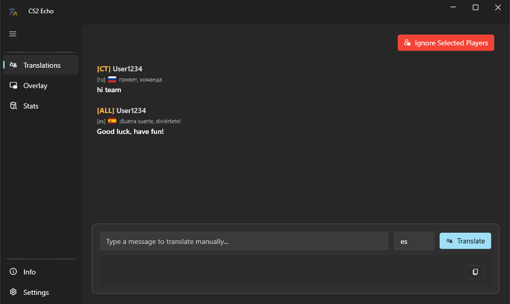
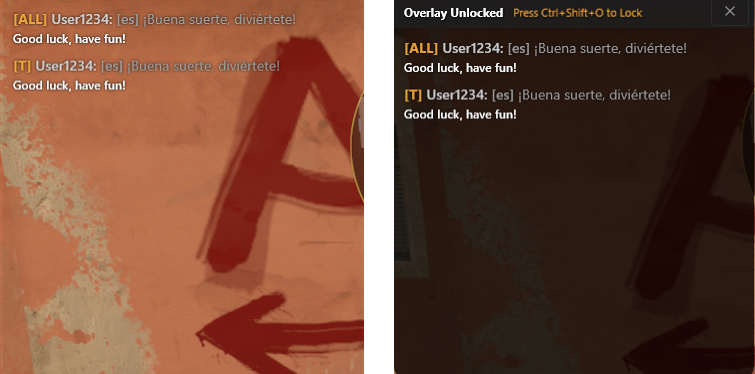
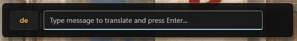
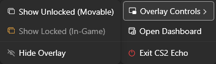

# CS2 Echo

CS2 Echo is a real-time CS2 translator and desktop application that monitors the Counter-Strike 2 console to provide live chat translation. It features a transparent in-game overlay and customizable hotkeys, allowing players to easily communicate across different languages without interrupting their gameplay.

## Key Features

- **Steam Auto-Start:** Hook directly into Steam's launch options to automatically boot CS2 Echo (minimized to your tray) the exact moment you start the game.
- **Auto-Detect Installation:** Instantly locate your CS2 folder across multiple Steam library drives with a single click.
- **Live Console Tailing:** Automatically reads incoming chat messages directly from the CS2 console log.
- **In-Game Overlay:** A click-through, transparent overlay that displays translated messages directly over your game. Can be configured to auto-launch silently.
- **Quick Translate Hotkeys:** Instantly translate and copy your own messages to the clipboard using customizable global hotkeys.
- **Multiple Translation Engines:** Support for Google Translate (Free), DeepL API, and Gemini API to ensure accurate translations.
- **Translation Caching:** Stores previously translated phrases locally to instantly translate recurring messages and save on API usage.
- **Secure API Storage:** If you use DeepL or Gemini, your API keys are safely encrypted locally on your machine using Windows DPAPI.
- **Player Filtering & Stats:** Ignore specific players and track local statistics on which languages your teammates are using.

## Installation & Setup

1. **Enable CS2 Console Logging:**
   Right-click Counter-Strike 2 in Steam, go to Properties, and add `-condebug` to your Launch Options. This forces the game to write chat logs to a file.

2. **Download the App:**
   Download the latest installer or portable version from the [Releases](https://github.com/LDzik/CS2-Echo/releases/latest) page.

3. **Launch and Configure:**
   Run `CS2 Echo`. Open the Settings tab and click **Auto-Detect** to automatically find your CS2 folder (or browse manually). Select your preferred translation engine and enter your API keys if using DeepL or Gemini.

4. **Configure Auto-Start (Recommended):**
   In the Settings tab, copy the provided Steam Integration string and paste it at the _very beginning_ of your CS2 Launch Options in Steam. Click **Verify** to ensure it's set up correctly. CS2 Echo will now launch automatically whenever you play!

## Keeping the App Updated

CS2 Echo features a built-in auto-updater. You do not need to download new installers from GitHub when a new version drops!

1. Open the **Info** page from the main dashboard's footer menu.
2. Click the **Check for Updates** button.
3. If an update is found, you can read the latest release notes right there.
4. Click **Install & Restart** to automatically apply the update and relaunch the app.

## Usage Guide

### The In-Game Overlay

Launch the overlay from the main dashboard or the system tray. When unlocked, you can drag the overlay to position it anywhere on your screen. Once placed, lock the overlay to make it transparent and click-through while you play.

Toggle the overlay visibility at any time using your configured global hotkey (default: `Ctrl + Shift + O`). You can also enable **Auto-Launch Overlay** in the settings so it automatically spawns in a locked, transparent state when the app opens.

### Quick Translate

Need to say something in another language? Press the Quick Translate global hotkey (default: `Ctrl + Shift + T`). A small window will appear. Type your message, press `Enter`, and the translated text will be copied to your clipboard, ready to paste into the CS2 chat.

To change the target language, simply press `Tab` while in the Quick Translate window and type the desired language code.

### System Tray

When closed, the app minimizes to the system tray. Right-click the icon to quickly show/hide the overlay or reopen the main dashboard.

## Built With & Credits

CS2 Echo is made possible by the following open-source projects and APIs:

**Core & UI**

- [.NET 10](https://dotnet.microsoft.com/) (C# & WPF)
- [WPF-UI](https://github.com/lepoco/wpfui) - Modern Fluent design components.
- [CommunityToolkit.Mvvm](https://github.com/CommunityToolkit/dotnet) - Source-generated MVVM architecture.
- [Markdig.Wpf](https://github.com/Kryptos-FR/markdig.wpf) - Markdown rendering for release notes.

**Data & Updates**

- [SQLite](https://sqlite.org/) - Local database for translation caching and stats.
- [Velopack](https://velopack.io/) - Installation and auto-update framework.

**Translation APIs**

- [DeepL.net](https://github.com/DeepLcom/deepl-dotnet) - Official DeepL API client.
- [Google.GenAI](https://github.com/googleapis/dotnet-genai) - Official Gemini API client.

**Design**

- **App Icon:** Modified from original work by [Ooh Seha](https://icon-icons.com/authors/1510-ooh-seha), licensed under [CC BY 4.0](https://creativecommons.org/licenses/by/4.0/).

## Feedback & Issues

Found a bug or have a feature request? Please open an issue on the GitHub repository to let me know!

## License

This project is licensed under the [GNU GPLv3 License](LICENSE) - see the LICENSE file for details.
